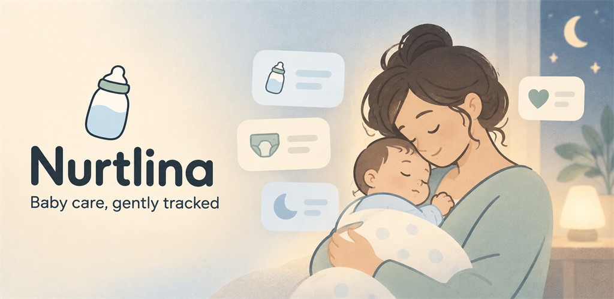

# Nurtlina Google Play 发布物料规划

> 应用名称：**Nurtlina: Baby Feeding Tracker**  
> 平台：Android / Google Play  
> 定位：帮助父母和照护者快速记录喂养、尿布与睡眠，并提供平静、非打扰式的提醒。

## 顶部宽图

- 文件：`google-play-feature-graphic-1024x500.png`
- 尺寸：`1024 × 500 px`
- 主文案：`Nurtlina`
- 副文案：`Baby care, gently tracked`
- 视觉方向：暖米色、雾蓝、柔和鼠尾草绿；低刺激、平静、适合夜间育儿场景。
- 合规约束：不使用医疗符号、健康结论、权威背书、安全保证或真实个人数据。

## 已生成文件

- [`store-copy.md`](./store-copy.md)：五种语言的商店名称、简短说明和完整说明草案。
- [`data-safety-draft.md`](./data-safety-draft.md)：依据当前依赖和数据流整理的 Data Safety 填写草案。
- [`review-access.md`](./review-access.md)：Google Play App Access 审核说明模板。
- [`release-notes.md`](./release-notes.md)：五种语言的首发版本说明。
- [`brand-guide.md`](./brand-guide.md)：商店物料品牌色、构图和文案规范。
- [`screenshot-production.md`](./screenshot-production.md)：固定演示数据和 8 张截图拍摄脚本。
- [`play-console-checklist.md`](./play-console-checklist.md)：可执行的 Play Console 提交检查表。
- `app-icon-512.png`：从当前正式应用图标整理的商店图标副本。

## 一、商店截图规划

建议制作 8 张竖版手机截图，每张只表达一个核心利益点。前 3 张承担主要转化，应优先精修。

### 1. 轻松记录每一次喂养

- 画面：Today 首页全景。
- 重点：突出 Quick Feed / Log feeding 主按钮。
- 目的：第一眼证明核心操作简单、直接。

### 2. 几下即可完成记录

- 画面：喂养类型、奶量和保存流程。
- 重点：展示较少的操作步骤和清晰的大按钮。
- 目的：传达疲惫或夜间场景下也能快速使用。

### 3. 今天的照护，一眼看清

- 画面：Today Summary。
- 重点：今日喂养、尿布和睡眠摘要。
- 目的：证明信息集中，不需要来回翻找。

### 4. 温和提醒下一次喂养

- 画面：下一次喂养提醒卡或通知预览。
- 重点：平静、可配置、不依赖网络。
- 禁止：不得暗示“准时喂养才能健康”或做出医学判断。

### 5. 喂养、尿布与睡眠都在一起

- 画面：Logs 时间线。
- 重点：不同记录类型清晰区分，时间顺序易读。
- 目的：表现日常照护记录的完整性。

### 6. 从日常记录中了解规律

- 画面：Insights 图表和趋势摘要。
- 重点：记录趋势与日常规律。
- 禁止：不得使用“健康评估”“正常/异常”“诊断”等措辞。

### 7. 没有网络，也能安心记录

- 画面：离线状态下成功保存记录。
- 重点：本地优先，网络恢复后再同步。
- 禁止：不承诺实时同步或永不丢失。

### 8. 为每位照护者而设计

- 画面：深色模式、大字体、多宝宝或 Pro 能力。
- 重点：夜间体验、可访问性和进阶功能。
- 要求：Pro 功能应明确标识，不制造误导。

### 截图统一规范

- 建议尺寸：`1080 × 1920 px`。
- 每张标题建议控制在 8–14 个中文字符。
- 手机界面建议占画面约 65%–75%。
- 使用现有暖米色、雾蓝、柔和鼠尾草绿和深灰色。
- 每张只表达一个卖点，减少小字和装饰元素。
- 不显示真实宝宝姓名、邮箱、订单号、设备 ID 或敏感记录。
- 英语、西班牙语、德语、法语和简体中文版本分别截图，避免标题与界面语言混用。

## 二、Google Play 商店展示物料

### 必需物料

- [x] 应用图标：`512 × 512 PNG`。
- [x] 顶部宽图：`1024 × 500 PNG`。
- [ ] 手机截图：至少 2 张，建议完成上述 8 张。
- [x] 应用名称：`Nurtlina: Baby Feeding Tracker`。
- [x] 简短说明草案：一句话表达核心价值。
- [x] 完整说明草案：功能、Free/Pro 区别、离线能力和免责声明。
- [x] 应用类别与标签建议。
- [x] 开发者联系邮箱：`support@muyestudio.net`。
- [x] 隐私政策链接：`https://nurtlina.app/privacy`。

### 建议补充

- [ ] 30–45 秒宣传视频，并通过 YouTube 关联。
- [ ] 平板截图；如果应用允许平板安装，应一并准备。
- [x] 版本更新说明模板。
- [ ] 无文字品牌背景图，便于后续活动或编辑推荐场景复用。
- [ ] 官网落地页与支持页面。

### 本地化范围

- [ ] 英语。
- [ ] 西班牙语。
- [ ] 简体中文。
- [ ] 德语。
- [ ] 法语。

应用名称、简短说明、完整说明、截图标题和截图中的界面语言应保持一致。

## 三、截图制作所需素材

- [x] 固定截图数据集和拍摄脚本。
- [x] 完全虚构的宝宝昵称。
- [x] 自然但不对应真实用户的喂养、尿布和睡眠记录。
- [ ] 浅色模式界面。
- [ ] 深色／夜间模式界面。
- [ ] Free 状态界面，包括不干扰核心操作的广告位置。
- [ ] Pro 状态界面。
- [ ] 离线状态界面。
- [ ] 通知权限允许与拒绝状态。
- [ ] 不含真实邮箱、订单号、设备标识或宝宝信息的账号页面。

建议使用固定数据集生成截图，以便后续版本更新时稳定复现。

## 四、审核与合规材料

- [ ] 隐私政策。
- [ ] Google Play Data Safety 表单。
- [ ] 广告声明。
- [ ] 目标受众与内容声明。
- [ ] 内容分级问卷。
- [x] App Access 审核说明模板。
- [ ] 审核测试账号或明确的登录步骤。
- [ ] 账号和云端数据删除入口说明。
- [x] 通知权限用途说明草案。
- [x] 订阅条款和自动续费说明已存在于官网条款。
- [x] 联系、反馈及退款支持方式已存在于官网支持页。
- [x] 第三方 SDK 数据收集清单草案。

### Data Safety 核对范围

- Firebase Auth。
- Firestore 或当前后端同步服务。
- Firebase Analytics。
- Firebase Crashlytics。
- AdMob。
- Google Play Billing 或 RevenueCat。

需要准确披露广告 ID、崩溃日志、账号标识以及云端备份数据。分析事件不得包含宝宝真实姓名、备注内容或敏感健康信息。

## 五、正式发布文件与配置

- [ ] 签名后的 Android App Bundle：`.aab`。
- [ ] Play App Signing 配置。
- [ ] 正式 `versionName` 与 `versionCode`。
- [ ] 混淆映射文件：`mapping.txt`。
- [ ] 原生调试符号；仅在应用包含原生库时需要。
- [ ] 发布说明。
- [ ] 内部测试版本。
- [ ] 封闭测试名单与反馈渠道。
- [ ] 测试通过记录。
- [ ] 订阅商品、Base Plan 和价格配置。
- [ ] Lifetime 一次性商品配置。
- [ ] 测试购买账号。

## 六、支持与品牌资产

- [ ] Logo：透明背景版本。
- [ ] Logo：浅色背景版本。
- [ ] Logo：深色背景版本。
- [ ] 品牌色、字体和留白规范。
- [ ] 官网首页。
- [ ] `/privacy` 隐私政策页面。
- [ ] `/terms` 使用条款页面。
- [ ] `/support` 支持页面。
- [ ] `/delete-account` 账号删除说明页面。
- [ ] 客服邮件模板。
- [ ] 常见问题 FAQ。
- [ ] 媒体包：图标、顶部宽图、3–5 张精选截图及产品简介。

## 七、商店文案合规

### 推荐表达

- “快速记录喂养、尿布和睡眠。”
- “温和提醒下一次喂养。”
- “即使离线也能记录。”
- “从日常记录中了解照护规律。”
- “本应用提供记录和提醒工具，不提供医疗建议。”
- “请遵循配方奶标签、当地指导和儿科医生的建议。”

### 禁止或避免表达

- “确保宝宝健康。”
- “判断奶是否安全。”
- “医学认可”或“医生推荐”。
- “CDC、AAP、NHS 或其他机构认证”。
- “精准预测宝宝需求。”
- “健康评估”“诊断”“正常／异常”。

## 八、推荐制作顺序

1. 确认应用图标终稿。
2. 建立固定商店截图数据集。
3. 完成前 3 张核心转化截图。
4. 完成其余 5 张功能截图。
5. 编写英文商店名称、简短说明和完整说明。
6. 准备隐私政策与 Data Safety 数据清单。
7. 准备审核测试账号和 App Access 说明。
8. 完成其余四种语言的文案与截图本地化。
9. 配置订阅、Lifetime 商品和测试购买流程。
10. 上传内部测试版本并完成发布前检查。

## 发布前验收标准

- [ ] 所有截图均来自当前可发布版本，没有展示尚未实现的能力。
- [ ] 截图与商店文案不包含医疗、安全或权威背书暗示。
- [ ] Free 与 Pro 权益表达准确。
- [ ] 离线能力和同步能力没有被夸大。
- [ ] 所有展示数据均为虚构数据。
- [ ] 深色模式、大字体和通知拒绝场景已检查。
- [ ] 隐私政策、Data Safety 表单和实际 SDK 行为一致。
- [ ] 核心本地记录功能在后端不可用时仍能工作。
- [ ] 商店页面、应用内文案和订阅价格保持一致。
